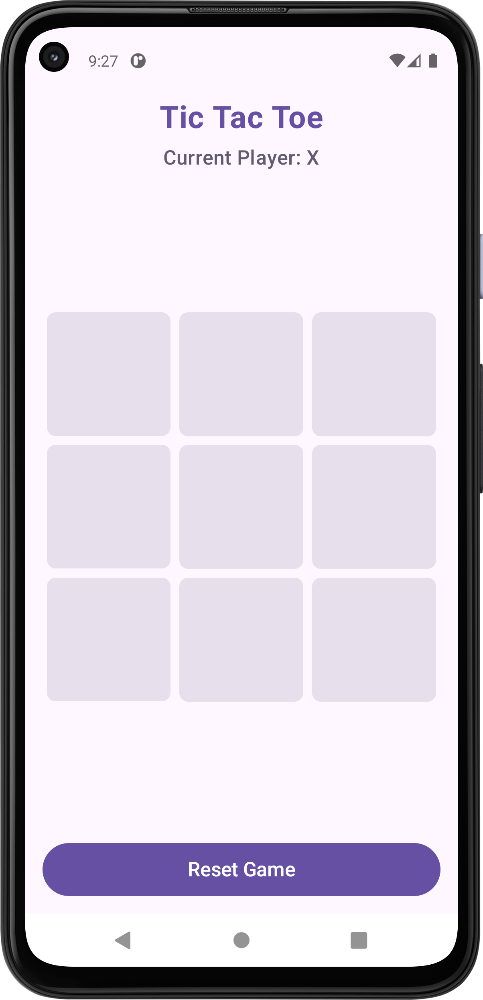
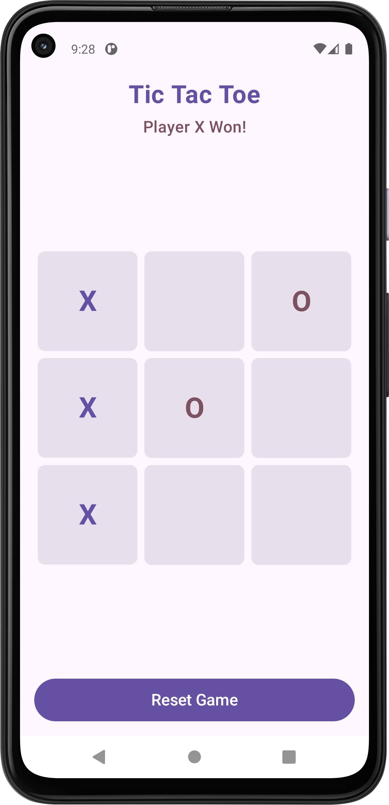
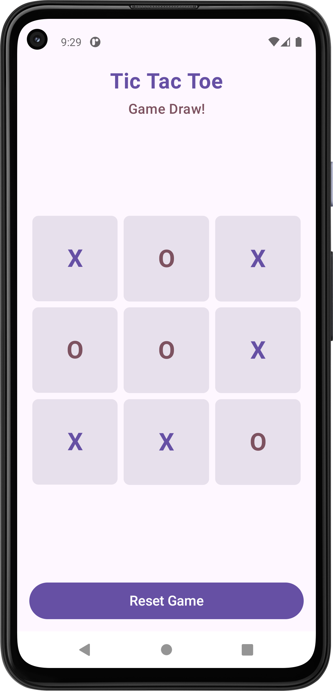

# Tic Tac Toe - a Android Game with TDD Approach

The Tic Tac Toe developed with Test-Driven Development (TDD) approach along with clean architecture, MVVM pattern and Koin dependency injection.

## Game Rules:

1. ✅ Game is over when all fields are taken (draw condition)
2. ✅ Game is over when all fields in a column are taken by a player (column win)
3. ✅ Game is over when all fields in a row are taken by a player (row win)
4. ✅ Game is over when all fields in a diagonal are taken by a player (diagonal win)
5. ✅ A player can take a field if not already taken (move validation)
6. ✅ Players take turns (alternating between X and O)
7. ✅ Two players in the game (X and O)

## Tech Stack & Architecture:

* MVVM with Clean Architecture
* Language - Kotlin
* UI - Jetpack Compose
* DI - Koin
* Task - Coroutines, Flow
* Unit Test - JUnit, Mockk
* Instrumentation Test - JUnit, Compose Test

## Clone Project:
* Use the below clone URL to clone the project on your studio IDE.

    https://github.com/gakarthikeyan/tic-tac-toe.git

## Run all tests:
./gradlew test

## Run Instrumentation tests:
./gradlew connectedAndroidTest

## Game Screens:

✅ Game Start!

✅ Player X Won!

✅ Game Draw!